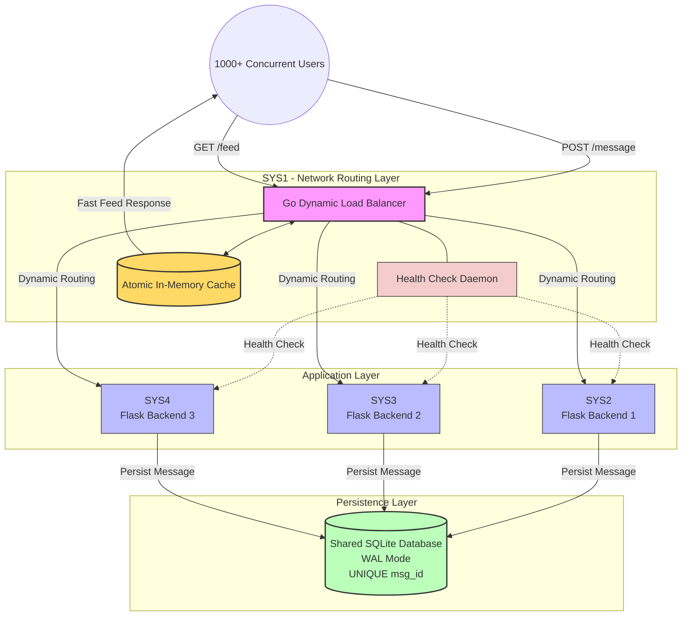
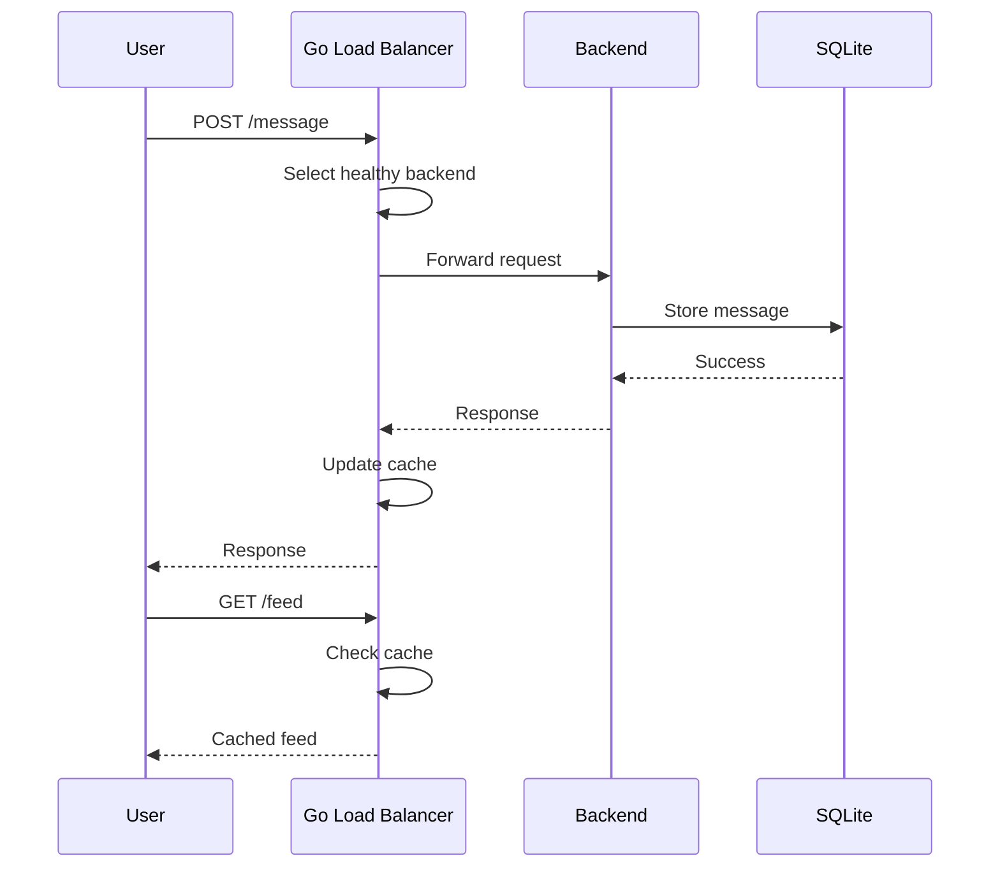

# Distributed Group Chat & Dynamic Load Balancer

A highly available distributed group-chat system built across **4 systems**. The project uses a custom-built **Go Dynamic Load Balancer** in front of three independent **Python Flask + Gunicorn backend servers**, with a shared **SQLite database** for persistent message storage.

The architecture focuses on:

- Dynamic load balancing
- Backend health monitoring
- Fault tolerance
- High concurrency
- In-memory caching
- Database persistence
- Message idempotency
- Graceful degradation
- Automatic backend recovery

---

## 🏗️ Architecture Overview



---

# 📌 Project Overview

This project implements a distributed group-chat architecture where incoming client requests are handled by a custom Go Load Balancer.

Instead of allowing clients to communicate directly with the backend servers, all traffic first reaches the Load Balancer.

```text
                    CLIENTS
                       |
                       v
              +----------------+
              | Go Load        |
              | Balancer       |
              | SYS1           |
              +-------+--------+
                      |
          +-----------+-----------+
          |           |           |
          v           v           v
       SYS2        SYS3        SYS4
      Flask       Flask       Flask
       API          API         API
          \           |          /
           \          |         /
            +---------+--------+
                      |
                      v
               +-------------+
               |   SQLite    |
               |  Database   |
               +-------------+
```

The Load Balancer continuously monitors backend servers and dynamically routes requests toward available servers.

---

# 🖥️ System Architecture

The system consists of **four systems**.

| System | Role | Technology |
|---|---|---|
| SYS1 | Load Balancer | Go |
| SYS2 | Backend Server 1 | Flask + Gunicorn |
| SYS3 | Backend Server 2 | Flask + Gunicorn |
| SYS4 | Backend Server 3 | Flask + Gunicorn |

All three backend systems communicate with the shared database.

---

# 1️⃣ SYS1 - Go Dynamic Load Balancer

The first system acts as the network routing layer.

### Main Component

```text
loadbalancer/main.go
```

The Load Balancer is implemented from scratch using Go.

It is responsible for:

- Receiving client requests
- Routing requests to backend servers
- Monitoring backend health
- Measuring backend response latency
- Detecting failed servers
- Detecting slow servers
- Removing unhealthy servers from the routing pool
- Reintroducing recovered servers
- Maintaining the in-memory cache
- Handling concurrent HTTP connections

Go Goroutines allow the Load Balancer to handle many concurrent requests efficiently.

---

# 2️⃣ SYS2 - Python Backend 1

SYS2 runs the first Flask backend server.

```text
SYS2
 |
 +-- Flask
 +-- Gunicorn
 +-- Database Interface
 +-- Message Processing
```

Responsibilities include:

- Processing API requests
- Validating messages
- Performing application logic
- Writing messages to the database
- Returning responses

---

# 3️⃣ SYS3 - Python Backend 2

SYS3 provides a second independent backend instance.

```text
SYS3
 |
 +-- Flask
 +-- Gunicorn
 +-- Database Interface
 +-- Message Processing
```

The second backend provides redundancy and allows the Load Balancer to distribute incoming traffic.

---

# 4️⃣ SYS4 - Python Backend 3

SYS4 provides the third backend instance.

```text
SYS4
 |
 +-- Flask
 +-- Gunicorn
 +-- Database Interface
 +-- Message Processing
```

Having multiple backend systems allows the application to continue operating when one backend becomes unavailable.

---

# ⚡ Dynamic Load Balancing

Traditional Round-Robin routing does not consider the current health or performance of a backend.

For example:

```text
Request 1 → SYS2
Request 2 → SYS3
Request 3 → SYS4
Request 4 → SYS2
Request 5 → SYS3
Request 6 → SYS4
```

If SYS3 becomes slow or unavailable, a simple Round-Robin algorithm may continue sending requests to SYS3.

This project instead uses **performance-aware dynamic routing**.

---

# ❤️ Health Monitoring

A background health-check daemon periodically checks all backend servers.

The health checker monitors:

- HTTP availability
- HTTP status code
- Response latency

Example:

```text
Backend       Latency       Status
-------------------------------------
SYS2          25 ms         HEALTHY
SYS3          40 ms         HEALTHY
SYS4          220 ms        SLOW
```

If a backend becomes unhealthy, the Load Balancer can remove it from the normal routing pool.

---

# ⏱️ Latency Threshold

The configured backend latency threshold is:

```text
150 ms
```

If a backend exceeds the configured threshold, it can be considered unhealthy.

Example:

```text
SYS2 → 30 ms   → HEALTHY
SYS3 → 55 ms   → HEALTHY
SYS4 → 185 ms  → UNHEALTHY
```

Traffic can then be redirected toward the remaining healthy servers.

---

# ❌ Backend Failure Handling

Suppose all three servers are initially healthy:

```text
              Load Balancer
             /      |      \
            v       v       v
          SYS2    SYS3    SYS4
           ✓       ✓       ✓
```

If SYS3 fails:

```text
              Load Balancer
             /             \
            v               v
          SYS2            SYS4
           ✓                 ✓

                 SYS3
                  ✗
```

The Load Balancer detects the failure through health checks and stops sending normal traffic to SYS3.

---

# 🔄 Backend Recovery

When SYS3 becomes available again, the health checker detects the recovery.

```text
SYS3
 |
 | Failed
 v
Health Check
 |
 | Successful
 v
Healthy
 |
 v
Rejoin Backend Pool
```

The recovered backend can then participate in request processing again.

---

# 🛡️ Graceful Degradation

During a large traffic spike, all backend servers may temporarily become slower than the normal latency threshold.

Instead of completely rejecting traffic, the Load Balancer supports a **fail-open behavior**.

Normal condition:

```text
SYS2 → Healthy
SYS3 → Healthy
SYS4 → Healthy
```

Heavy load:

```text
SYS2 → Slow
SYS3 → Slow
SYS4 → Slow
```

Instead of dropping all traffic:

```text
             Load Balancer
             /     |     \
            v      v      v
          SYS2   SYS3   SYS4
```

Traffic continues to be distributed across the available servers.

This provides graceful degradation during temporary load spikes.

---

# ⚡ In-Memory Cache

The Load Balancer maintains an in-memory cache for chat messages.

This is particularly useful for frequent:

```text
GET /feed
```

requests.

Without caching:

```text
Client
  |
  v
Load Balancer
  |
  v
Backend
  |
  v
SQLite
  |
  v
Response
```

With caching:

```text
Client
  |
  v
Load Balancer
  |
  v
In-Memory Cache
  |
  v
Response
```

This can reduce unnecessary backend and database reads.

---

# 🔐 Atomic Cache Updates

The cache update mechanism uses Go atomic pointer operations instead of protecting the cache with a traditional Mutex on the read path.

Conceptually:

```text
New Message
     |
     v
Create Updated Cache
     |
     v
Atomic Pointer Swap
     |
     v
Updated Cache
```

This design minimizes lock contention between concurrent readers and writers.

---

# 💾 Database Persistence

The application uses SQLite as the persistent storage layer.

The database is configured to use:

```sql
PRAGMA journal_mode=WAL;
```

WAL stands for:

```text
Write-Ahead Logging
```

WAL mode allows readers and writers to operate with improved concurrency compared with SQLite's traditional rollback journal behavior.

---

# 🗄️ Shared Database

The three backend systems use the same logical database:

```text
                 SQLite
                   |
        +----------+----------+
        |          |          |
        v          v          v
      SYS2       SYS3       SYS4
```

Each backend can persist chat messages to the database.

The database acts as the persistent source of truth.

---

# 🔑 Message Idempotency

Every message has a unique:

```text
msg_id
```

Example:

```json
{
    "msg_id": 1001,
    "username": "user1",
    "message": "Hello!"
}
```

The database enforces uniqueness on `msg_id`.

Conceptually:

```sql
CREATE TABLE messages (
    msg_id INTEGER PRIMARY KEY,
    username TEXT,
    message TEXT
);
```

---

# 🔁 Duplicate Request Protection

Suppose a client sends:

```text
msg_id = 1001
```

The server stores the message.

If the client retries the same request because of network latency:

```text
msg_id = 1001
```

the database detects that the message ID already exists.

```text
First Request
     |
     v
msg_id = 1001
     |
     v
INSERT
     |
     v
SUCCESS


Retry
     |
     v
msg_id = 1001
     |
     v
Duplicate
     |
     v
No second message
```

This prevents duplicate message records.

---

# 🔢 Message ID Type Handling

The Load Balancer also handles different representations of message IDs.

For example:

```text
1001
```

and:

```text
"1001"
```

can be normalized before being passed to the backend.

This helps maintain consistent message identification across different clients and request formats.

---

# 🔀 POST /message Request Flow

When a user sends a message:

```text
Client
  |
  | POST /message
  v
Go Load Balancer
  |
  | Select Healthy Backend
  v
SYS2 / SYS3 / SYS4
  |
  | Validate + Process
  v
SQLite
  |
  | Store Message
  v
Backend
  |
  v
Load Balancer
  |
  v
Client
```

---

# 📥 GET /feed Request Flow

Feed requests can be served directly from the Load Balancer's in-memory cache.

```text
Client
  |
  | GET /feed
  v
Go Load Balancer
  |
  v
In-Memory Cache
  |
  v
Client
```

This avoids unnecessary database access when cached data is available.

---

# 🧠 Complete Request Architecture



---

# 🧪 Failure Scenario

Consider:

```text
SYS2 → HEALTHY
SYS3 → HEALTHY
SYS4 → HEALTHY
```

Now SYS3 stops responding.

The health checker detects:

```text
SYS3 → HTTP Failure
```

The routing table becomes:

```text
SYS2 → AVAILABLE
SYS3 → UNAVAILABLE
SYS4 → AVAILABLE
```

Traffic is then distributed between SYS2 and SYS4.

---

# 📊 Backend Health Example

```text
+---------+----------+------------+
| Backend | Latency  | Status     |
+---------+----------+------------+
| SYS2    | 25 ms    | HEALTHY    |
| SYS3    | 35 ms    | HEALTHY    |
| SYS4    | 185 ms   | UNHEALTHY  |
+---------+----------+------------+
```

The Load Balancer dynamically adjusts the routing pool based on this information.

---

# 🧩 Technology Stack

| Layer | Technology |
|---|---|
| Load Balancer | Go |
| HTTP Networking | Go `net/http` |
| Concurrency | Goroutines |
| Atomic Operations | `sync/atomic` |
| Backend | Python |
| Web Framework | Flask |
| Application Server | Gunicorn |
| Database | SQLite |
| Database Journal | WAL |
| Communication | HTTP/REST |
| Architecture | Distributed System |

---

# 📁 Project Structure

```text
distributed-group-chat/
│
├── loadbalancer/
│   ├── main.go
│   ├── go.mod
│   └── ...
│
├── sys2/
│   ├── app.py
│   ├── requirements.txt
│   └── ...
│
├── sys3/
│   ├── app.py
│   ├── requirements.txt
│   └── ...
│
├── sys4/
│   ├── app.py
│   ├── requirements.txt
│   └── ...
│
├── database/
│   └── chat.db
│
├── README.md
└── ...
```

> Modify the directory names above if your actual repository uses a different structure.

---

# 🔌 API Endpoints

## POST `/message`

Creates a new chat message.

### Request

```http
POST /message
Content-Type: application/json
```

Example:

```json
{
    "msg_id": 1001,
    "username": "user1",
    "message": "Hello everyone!"
}
```

### Response

```json
{
    "status": "success",
    "message": "Message stored successfully"
}
```

---

# GET `/feed`

Retrieves chat messages.

Example:

```http
GET /feed
```

The Load Balancer can serve this request directly from the in-memory cache.

---

# ⚙️ Load Balancer Logic

The Load Balancer maintains a collection of backend servers.

Conceptually:

```text
Backend Pool

+---------+-----------+----------+
| Server  | Latency   | Status   |
+---------+-----------+----------+
| SYS2    | 20 ms     | Healthy  |
| SYS3    | 45 ms     | Healthy  |
| SYS4    | 170 ms    | Slow     |
+---------+-----------+----------+
```

The Load Balancer selects from the currently available backend pool.

---

# 🔄 Backend State Transitions

A backend can move through different states:

```text
              +----------+
              | HEALTHY  |
              +----+-----+
                   |
                   | High latency /
                   | HTTP failure
                   v
              +----------+
              | UNHEALTHY|
              +----+-----+
                   |
                   | Successful
                   | health checks
                   v
              +----------+
              | HEALTHY  |
              +----------+
```

---

# 📈 Scalability

The architecture can be extended by adding more backend servers.

Current architecture:

```text
                Load Balancer
                /     |     \
               v      v      v
             SYS2   SYS3   SYS4
```

Additional servers can be added:

```text
                     Load Balancer
                          |
       +----------+-------+-------+----------+
       |          |       |       |          |
       v          v       v       v          v
     SYS2       SYS3    SYS4    SYS5       SYS6
```

The health monitoring mechanism can also be extended to the additional backend nodes.

---

# 🚀 Running the Project

## Step 1 - Start Backend SYS2

Navigate to the backend directory:

```bash
cd sys2
```

Install dependencies:

```bash
pip install -r requirements.txt
```

Start Gunicorn:

```bash
gunicorn -w 4 -b 0.0.0.0:5001 app:app
```

---

# Step 2 - Start Backend SYS3

```bash
cd sys3
pip install -r requirements.txt
gunicorn -w 4 -b 0.0.0.0:5002 app:app
```

---

# Step 3 - Start Backend SYS4

```bash
cd sys4
pip install -r requirements.txt
gunicorn -w 4 -b 0.0.0.0:5003 app:app
```

> Replace the ports with the actual ports configured in your project.

---

# Step 4 - Build the Go Load Balancer

Navigate to:

```bash
cd loadbalancer
```

Build:

```bash
go build -o loadbalancer main.go
```

---

# Step 5 - Start the Load Balancer

```bash
./loadbalancer
```

The Load Balancer should then:

1. Start the HTTP server
2. Load backend configuration
3. Start health monitoring
4. Initialize the cache
5. Accept client requests

---

# 🧪 Testing

## Test POST `/message`

```bash
curl -X POST http://localhost:8080/message \
-H "Content-Type: application/json" \
-d '{
    "msg_id": 1001,
    "username": "user1",
    "message": "Hello World!"
}'
```

---

## Test GET `/feed`

```bash
curl http://localhost:8080/feed
```

---

# 🔁 Test Idempotency

Send the same message twice:

```bash
curl -X POST http://localhost:8080/message \
-H "Content-Type: application/json" \
-d '{
    "msg_id": 1001,
    "username": "user1",
    "message": "Hello World!"
}'
```

Send it again:

```bash
curl -X POST http://localhost:8080/message \
-H "Content-Type: application/json" \
-d '{
    "msg_id": 1001,
    "username": "user1",
    "message": "Hello World!"
}'
```

The database should prevent the creation of a second record with the same `msg_id`.

---

# 💥 Test Fault Tolerance

Start all three servers:

```text
SYS2 → Running
SYS3 → Running
SYS4 → Running
```

Stop SYS3:

```text
SYS2 → Running
SYS3 → FAILED
SYS4 → Running
```

The health checker should detect the failure.

The Load Balancer should then remove SYS3 from the active backend pool.

---

# 🔄 Test Recovery

Restart SYS3:

```text
SYS2 → Running
SYS3 → Running
SYS4 → Running
```

The health checker detects successful responses from SYS3.

SYS3 can then be added back to the active backend pool.

---

# 📊 Performance Targets

The architecture is designed with the following targets:

| Metric | Target |
|---|---:|
| Concurrent Users | 1,000+ |
| Backend Latency Threshold | 150 ms |
| Health Check Interval | 2 seconds |
| Feed Cache Response | Sub-millisecond target |
| Backend Servers | 3 |
| Load Balancer Servers | 1 |

> These values represent architectural targets/configuration. Actual performance depends on hardware, network conditions, workload, database contention, and deployment configuration. Benchmark measurements should be reported separately.

---

# 🔒 High Availability

The system improves availability through multiple mechanisms.

### Backend Redundancy

Three independent backend servers are available.

```text
SYS2
SYS3
SYS4
```

### Health Monitoring

The Load Balancer continuously checks backend health.

### Failure Isolation

Failed servers can be removed from the routing pool.

### Recovery

Recovered servers can rejoin the routing pool.

### Persistent Storage

Messages are stored in SQLite.

### Caching

Frequently requested feed data can be served from memory.

---

# 🧠 Distributed System Concepts Demonstrated

This project demonstrates the following distributed-system concepts:

- Dynamic load balancing
- Health checking
- Fault tolerance
- Failover
- Failure detection
- Service redundancy
- Graceful degradation
- Caching
- Atomic operations
- Concurrent request handling
- Database persistence
- Idempotency
- Horizontal scaling
- Backend recovery
- Request routing

---

# ⚡ Why Go?

Go was selected for the Load Balancer because of its lightweight concurrency model.

Important features include:

- Goroutines
- Efficient HTTP networking
- Low-overhead concurrent processing
- Atomic operations
- Simple deployment
- Strong networking support

The Go layer therefore acts as an efficient network-facing component.

---

# 🐍 Why Flask + Gunicorn?

Flask provides a lightweight Python web framework for implementing the backend APIs.

Gunicorn provides a production-oriented WSGI application server and supports multiple workers.

The architecture separates responsibilities:

```text
Go
 |
 +-- Request Routing
 +-- Health Monitoring
 +-- Load Balancing
 +-- Cache
 |
 v
Python
 |
 +-- Business Logic
 +-- API Processing
 +-- Database Operations
```

---

# 🗃️ Why SQLite WAL?

SQLite is lightweight and does not require a separate database server.

WAL mode improves concurrent read/write behavior.

```text
PRAGMA journal_mode=WAL;
```

The database provides persistent storage while the Load Balancer cache provides a performance optimization.

---

# 🔐 Reliability Features

The architecture contains multiple reliability mechanisms:

```text
             Distributed Chat System
                     |
        +------------+------------+
        |            |            |
        v            v            v
    Health       Dynamic       Cache
   Monitoring    Routing
        |            |            |
        +------------+------------+
                     |
                     v
                Persistence
                     |
                     v
                  SQLite
                     |
                     v
                Idempotency
```

---

# 📌 Design Summary

```text
                    1000+ Users
                         |
                         v
              +---------------------+
              | Go Load Balancer     |
              |       SYS1           |
              +----------+----------+
                         |
              +----------+----------+
              |          |          |
              v          v          v
           +------+   +------+   +------+
           | SYS2 |   | SYS3 |   | SYS4 |
           |Flask |   |Flask |   |Flask |
           +--+---+   +--+---+   +--+---+
              |          |          |
              +----------+----------+
                         |
                         v
                  +-------------+
                  |    SQLite   |
                  |  WAL Mode   |
                  +-------------+
```

---

# 🎯 Project Objectives

The main objectives of the project are:

1. Build a custom Load Balancer using Go.
2. Distribute traffic across multiple Flask backend servers.
3. Monitor backend health automatically.
4. Detect failed and slow backend servers.
5. Dynamically adjust the backend routing pool.
6. Provide fault-tolerant request handling.
7. Reduce database reads using an in-memory cache.
8. Maintain persistent chat messages.
9. Prevent duplicate messages using unique IDs.
10. Support concurrent users efficiently.
11. Demonstrate practical distributed-system principles.
12. Provide backend recovery after failures.

---

# 🏁 Conclusion

This project combines a custom Go networking layer with multiple Python application servers and persistent database storage.

The overall architecture consists of:

```text
Go Load Balancer
        +
Health Monitoring
        +
Dynamic Routing
        +
Atomic In-Memory Cache
        +
Three Flask Backends
        +
Gunicorn
        +
SQLite WAL
        +
Message Idempotency
```

The result is a distributed group-chat architecture designed around **high availability, concurrency, fault tolerance, persistence, and efficient request routing**.

---

# 🛠️ Core Technologies

```text
Go
Python
Flask
Gunicorn
SQLite
HTTP/REST
Goroutines
sync/atomic
WAL
Distributed Systems
Load Balancing
Caching
```

---

# 📚 Key Terms

| Term | Meaning |
|---|---|
| Load Balancer | Distributes requests across backend servers |
| Health Check | Determines whether a backend is available |
| Failover | Redirects traffic when a server fails |
| Cache | Stores frequently accessed data in memory |
| WAL | SQLite Write-Ahead Logging |
| Idempotency | Prevents repeated requests from creating duplicate effects |
| Goroutine | Lightweight concurrent execution unit in Go |
| Atomic Operation | Operation performed without intermediate observable states |
| Horizontal Scaling | Adding additional backend servers |
| Fault Tolerance | Ability to continue operating despite component failures |

---

# 👨‍💻 Project Status

```text
Architecture              ✓
Go Load Balancer           ✓
Dynamic Routing            ✓
Health Monitoring          ✓
Backend Redundancy         ✓
Flask Backend Cluster      ✓
SQLite Persistence         ✓
WAL Configuration          ✓
Message Idempotency        ✓
In-Memory Cache             ✓
Failure Handling            ✓
Recovery Handling           ✓
```

---

## 📜 License

This project is developed for academic and educational purposes.
